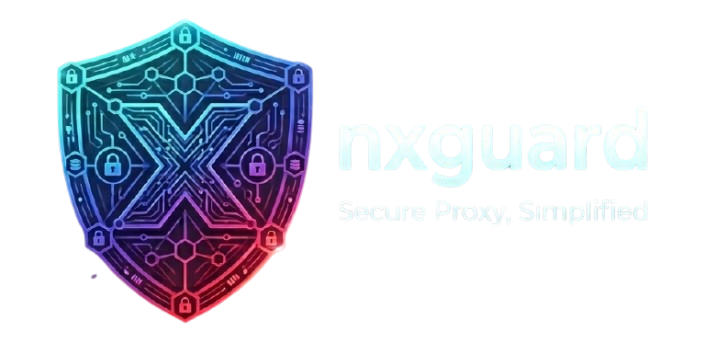
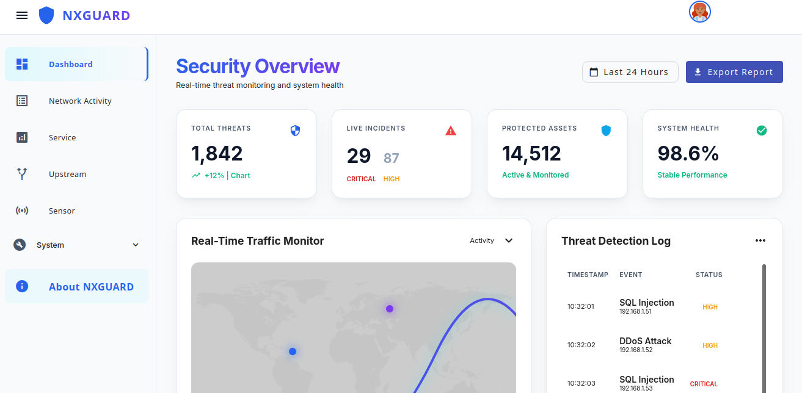
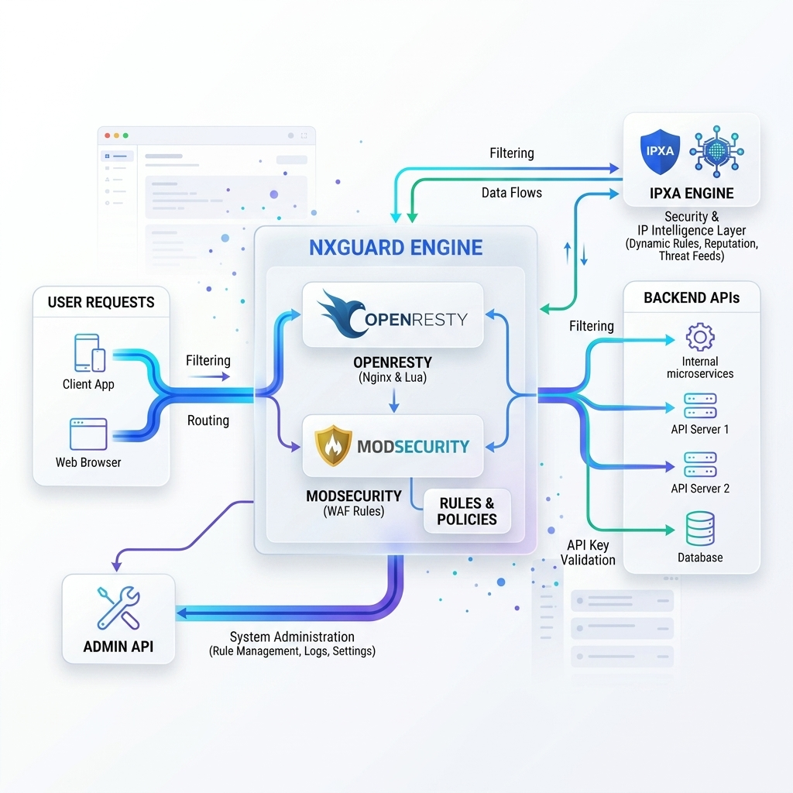
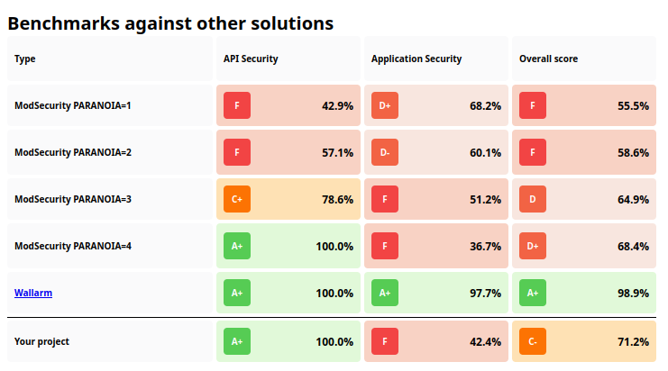

#  NXGuard

[](https://opensource.org/licenses/Apache-2.0)
[](https://www.docker.com/)
[](https://github.com/sponsors/liberatti)

**NXGuard** is a high-performance, secure API Gateway and Reverse Proxy powered by **OpenResty** and **ModSecurity**. It
provides a robust layer of protection for your API ecosystem, ensuring scalability, security, and operational
simplicity.

---

## 🚀 Key Features

- **🛡️ Advanced Security:** Native integration with **ModSecurity v3** for real-time threat detection (SQLi, XSS, etc.).
- **⚡ High Performance:** Leverages the power of **OpenResty (Nginx + LuaJIT)** for sub-millisecond request processing.
- **📊 Real-time Monitoring:** Detailed transaction logging and telemetry for proactive threat identification.
- **⚖️ Smart Load Balancing:** Sophisticated traffic distribution across backend services.
- **🛠️ Operational Simplicity:** Lightweight architecture with a modern management interface.
- **🌐 Scalability:** Modular design built for horizontal scaling in containerized environments.

---

## 📸 Dashboard Preview


*Modern, intuitive management interface for full control over your API security.*

---

## 🏗️ Architecture


*High-performance architecture integrating OpenResty, ModSecurity, and Redis.*

---

## 🚦 Getting Started

### Quick Start with Docker Compose

Deploy a full NXGuard stack including the Management UI and ipxa in seconds:

```yaml
services:
  redis:
    image: redis:7.2
    command: ["redis-server", "--save", "", "--appendonly", "no"]

  nxguard:
    image: liberatti/nxguard:latest
    environment:
      NXGUARD_ROLE: "main"
      SERVERID: "nxguard-admin"
    ports:
      - 5000:5000
      - 80:80
      - 443:443
    deploy:
      resources:
        limits:
          memory: 256M

  ipxa:
    image: liberatti/ipxa:latest
    volumes:
      - ipxa_data:/opt/ipxa/data
    deploy:
      resources:
        limits:
          memory: 64M
      replicas: 2

volumes:
  ipxa_data:
```

- **Management Interface:** [http://localhost:5000](http://localhost:5000)
- **Default Credentials:** `admin@nxguard.local` / `admin`

---

## 🧪 Security Validation

Validate your WAF rules using **GoTestWAF**:

```bash
docker run --rm \
  --shm-size=2g \
  --add-host nxguard.local:host-gateway \
  -v ${PWD}/.docs/reports:/app/reports \
  wallarm/gotestwaf --url=http://nxguard.local:8080/nxg/ --blockStatusCodes=403,404,400 --reportFormat=html --noEmailReport
```



*Generated by GoTestWAF showing blocking and alerting.*

```yaml
inspection:
    score:
        inbound: 5
        outbound: 10
    level: 3
```

---

## 🔢 WAF Rule ID Reservations

| Range                     | Description                |
|:--------------------------|:---------------------------|
| **1 - 99,999**            | Local/Internal Use         |
| **9001 - 9010**           | NXGuard Exclusion Lists (up to 10 items) |
| **100,000 - 199,999**     | Oracle Published Rules     |
| **200,000 - 299,999**     | Comodo Published Rules     |
| **300,000 - 399,999**     | GotRoot.com Rules          |
| **900,000 - 999,999**     | OWASP Core Rule Set (CRS)  |
| **2,000,000 - 2,999,999** | Trustwave SpiderLabs Rules |

---

## 📡 Telemetry Notice

To improve our security engine, NXGuard collects anonymous traffic statistics over 24-hour cycles. **No sensitive,
personal, or request-specific data is ever collected.** This information is used solely to enhance threat detection
accuracy.

---

## 📄 License

This project is licensed under the **Apache License 2.0**. See the [LICENSE](LICENSE) file for the full text.

---
Developed with ❤️ by **Gustavo Liberatti**